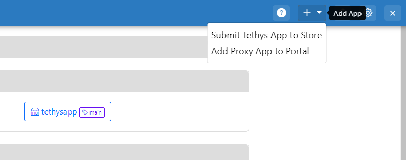
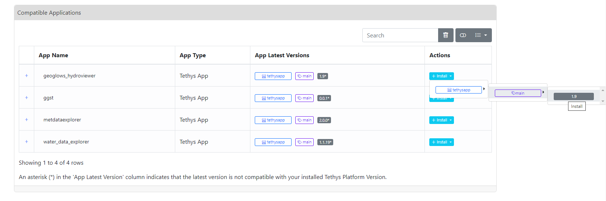
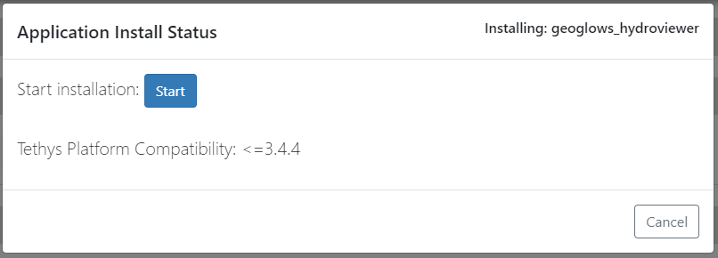

===================
Managing Proxy Apps
===================

Creating
========

Proxy apps can be installed via a conda channel the same way as a tethys application. If you want to create a new 
proxy application, you can click on the Add App button as highlighted in the image below and clicking on the 
"Add Proxy App to Portal" option: 

Upon clicking that button, you will be presented with a modal that asks for all the metadata for the proxy app. Once 
the inputs are filled out, click on "Create Proxy App".

Installing
==========

Applications that can be installed into the tethys portal are all hosted in an anaconda channel such as the 
`tethysapp <https://anaconda.org/tethysapp/repo>`_ channel. Users can install applications to the app store by 
clicking on the Install button in the application table and selecting the desired conda channel, conda label, and app 
version as highlighted in the image below: 

Upon clicking the desired app version, you will be presented with a modal to confirm the selection and start the 
application install process.

Updating
========

After an application is installed, users are given the options to uninstall or update the installed application. 

Click on the update button for the proxy app to change any of the proxy app metadata. The update form will be 
prepopulated with the current information. You can edit any information except the name. Once the form is updated, 
click on the "Update Proxy App" button to save the changes.

Submitting to App Store
=======================

Once a proxy app is configured correctly, you can click on the "Submit to App Store" button in the application table.

You can submit their tethys applications to the app store by click on the Add App button as highlighted in the 
image below and clicking on the "Submit Tethys App to Store" option. You will be presented with a modal that asks for 
an email address which is notified once the build is completed  successfully and the application is available on the 
app store. You will also need to select the store/conda channel where you want the application submitted and the label 
to be used.

