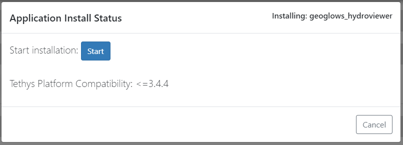
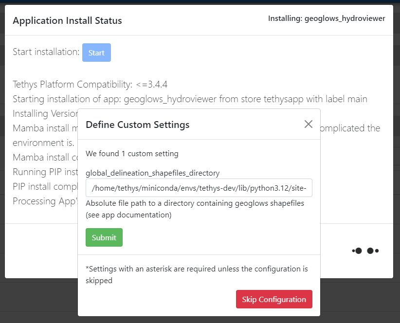
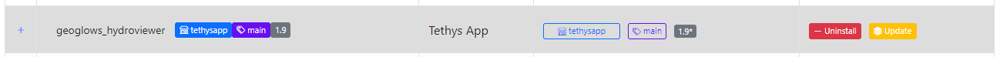
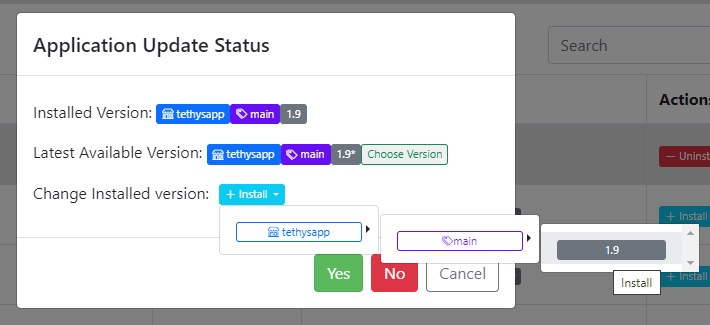
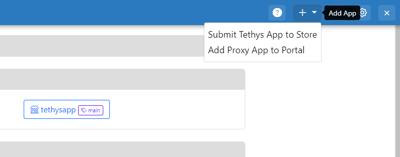
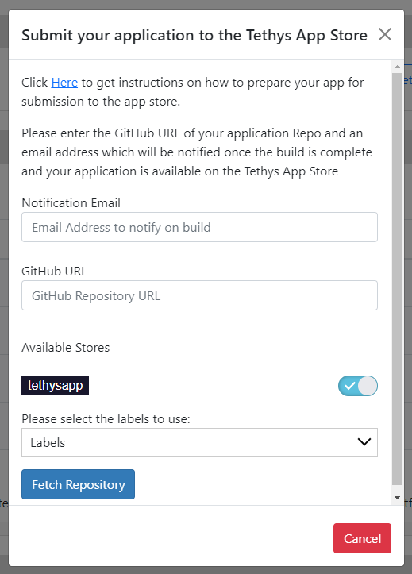

====================
Managing Tethys Apps
====================

Installing
==========

Applications that can be installed into the tethys portal are all hosted in an anaconda channel such as the 
`tethysapp <https://anaconda.org/tethysapp/repo>`_ channel. Users can install applications to the app store by 
clicking on the Install button in the application table and selecting the desired conda channel, conda label, and app 
version as highlighted in the image below: 

.. image:: _static/images/app_store_app_install.png
   :width: 600

Upon clicking the desired app version, you will be presented with a modal to confirm the selection and start the 
application install process.

After the application is successfully installed, the app store will attempt to configure the application as well. If 
the application has any custom settings, you will be prompted to supply the desired configuration and continue 
the process. You can also skip the settings configuration or submit the desired settings.

Updating
========

After an application is installed, users are given the options to uninstall or update the installed application. 

If you want to change the installed version of the application, you can click on the update button and you will be 
presented with a modal to select the version you want to install and start the process.

Submitting to App Store
=======================

Before attempting to submit your tethys application to the app store, ensure that your application fulfills the 
requirements for Tethys App Store: 

- Application is compatible with Tethys 3+
- Application should run on Python 3.7+
- Cleanup old init files if the application was upgraded from an older Tethys 2 compatible version.: 
  https://gist.github.com/rfun/ca38bb487ca1649be8491227adb7ca37

Application Metadata + setup.py
*******************************

The build process uses the setup.py file to pull the metadata for your application. The following fields are pulled 
from the setup.py and are displayed in the app store: 

- Application name (Same as release package)
- Version
- Description
- Keywords
- Author Name
- Author Email
- URL
- License

It is recommended to fill in the values in your setup.py so that your application has those details visible in the app 
store for easier discovery and filtering. 

Each time you have a new version for your application, it is recommended to update the version number in your setup.py 
file so that a new package is built and published. 

Steps to Submit
***************

You can submit their tethys applications to the app store by click on the Add App button as highlighted in the 
image below and clicking on the "Submit Tethys App to Store" option: 

Upon clicking that button, you will be presented with a modal that asks for the link to the GitHub Repository of your 
Tethys Application. It also instructs to put in an email address which is notified once the build is completed 
successfully and the application is available on the app store. You will also need to select the store/conda channel
where you want the application submitted and the label to be used.

- Enter Notification email address (Mostly this will be your own or the developer's email address)
- Enter the link to your GitHub Repository 
- Select the conda channels and labels that you would like to use for the submission
- If there are multiple branches on your GitHub repository, you will be presented with a list of branches on your 
  GitHub repository, Select the branch that you would like to submit to the application app store. The app store uses 
  the Master/Main branch in case only one branch exists. 
- After selecting the branch the app store begins the processing. Once the build is done, an email will be sent to the 
  address provided.